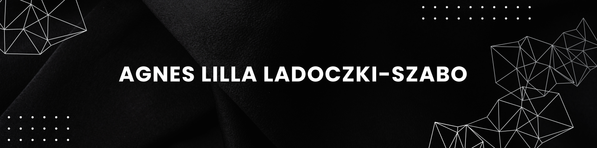
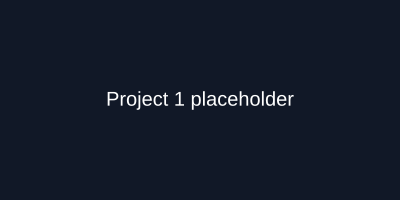
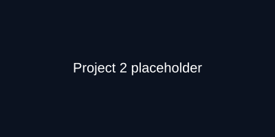
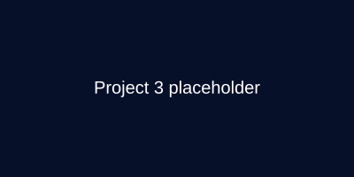
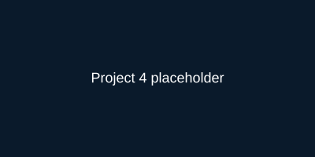
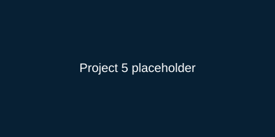
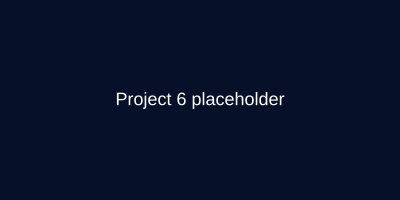

<!-- Hero image -->

  

> Over the past few years, I have placed a strong emphasis on expanding my IT knowledge.
> During this time, I gained hands-on experience through freelance manual testing projects,
> primarily via uTest.com and Testbirds.com. These projects involved executing test cases
> as well as exploratory testing, focusing on functional and usability aspects of various
> products.
> In the past year, I completed the Software Test Automation and Continuous Integration
> course at the University of Malta. This course provided me with a solid foundation in test
> automation, including hands-on experience with tools such as Selenium WebDriver,
> Cucumber, and Postman, as well as an introduction to the basics of CI/CD pipelines.
> I am currently pursuing a Bachelor of Science in Computer Science through remote
> learning, which predominantly requires weekend commitment. This flexible arrangement
> allows me to dedicate my time to a full-time junior testing or developer position where I
> can combine my acquired knowledge with practical experience and contribute to high
> quality software development.

---

## Summary

- Experienced in manual testing (functional, usability, exploratory)
- Software Test Automation & CI/CD (Java17, Selenium WebDriver, Cucumber, Postman)
- Currently studying BSc Computer Science

---

## Work Experience

**Freelance Software Tester**  
2023 – 2025

- Executed manual testing projects via crowdsourcing platforms (uTest, Testbirds).
- Performed functional and usability testing and exploratory testing to surface defects.
- Logged, tracked and reported issues; collaborated with development teams.

---

## Featured projects

<table>
  <tr>
    <td align="center" width="33%">
      
      
<strong>FrontEnd Application Development with React</strong>

      
Ongoing: coursework and projects building React applications as part of the curriculum.

      
<a href="https://github.com/Magnetika/FrontEnd-Application-Development-with-React">Repository</a> · **Status:** <strong>In progress</strong>

    </td>
    <td align="center" width="33%">
      
      
<strong>BringMeHome</strong>

      
A small unik project to help locate and manage pet information (HTML,CSS,Bootstrap,Javascript).

      
<a href="https://github.com/szludora/BringMeHome">Repository</a>

    </td>
    <td align="center" width="33%">
      
      
<strong>Responsive Web Design — freeCodeCamp</strong>

      
Collection of responsive web design projects and exercises (freeCodeCamp curriculum).

      
<a href="https://github.com/Magnetika/freecodecamp--Responsive-Webdesign">Repository</a>

    </td>
  </tr>
  <tr>
    <td align="center" width="33%">
      
      
<strong>Python — Zero to Hero</strong>

      
Exercises and small projects covering Python fundamentals up to intermediate topics.

      
<a href="https://github.com/Magnetika/Python_zero_to_hero">Repository</a>

    </td>
    <td align="center" width="33%">
      
      
<strong>Final Assignment</strong>

      
Automated web tests implemented in Java using Selenium WebDriver and Cucumber (BDD-style test automation).

      
<a href="https://github.com/Magnetika/Final-Assignment">Repository</a>

    </td>
    <td align="center" width="33%">
      
      
<strong>The Complete 2024 Web Dev Bootcamp</strong>

      
Collection of exercises and projects from the 2024 full-stack web development bootcamp.

      
<a href="https://github.com/Magnetika/Thecomplete2024WebDevBootcamp">Repository</a>

    </td>
  </tr>
</table>

---

## Skills & tools

          

---

Updated: 2025-12-11

